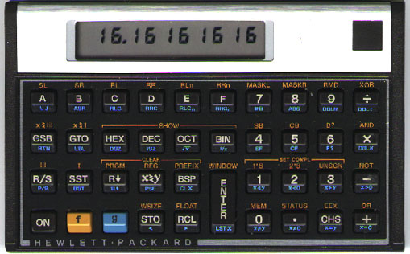
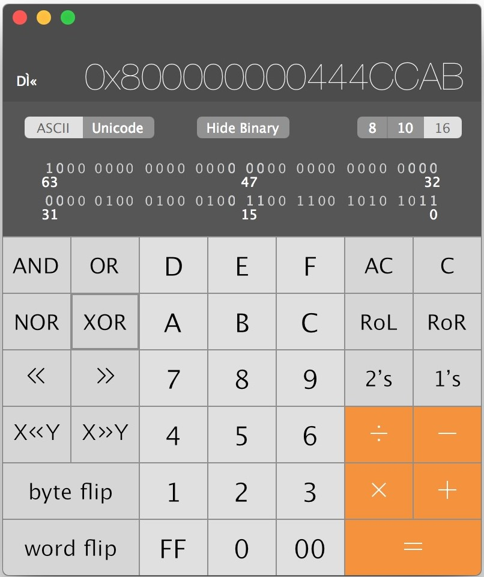
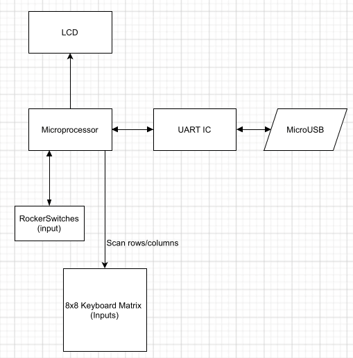

# HW: Invent an Imaginary Embedded System

## Idea: Programmable (Physical) Hex Calculator

---
### Motivation / Inspiration (What is it? What does it do?)
The calculator has been done many times before-- this is by no means an original idea. However, my goal is to make a calculator for us software engineers that do more low level bit-banging sort of stuff. The *only* calculator you'll need. No need to ever keep a python interpretor in the other terminal tab ever again.

</img>

It's sad to say but I've wanted to make this calculator for a very long time. The only hex calculator on the market is currently out of production and was made in 1982: the HP 16c.

</img>

The calculator I've envisioned for nearly a year now is basically a clone of the digital hex calculator Apple provides on their MacOSX operating system. With all the same functionality (and more) and with exactly the same layout. Down to the persistent binary representation that sits at the bottom of the display and the toggles for ascii/unicode.

</img>

The main goals would be:
 - Programmable mechanical keys (so that the key-caps could be rearranged)
 - Able to be plugged in via USB and use the calculator as a hex number-pad for programming.
 - LCD with persistent binary representation at the bottom.
 - Toggles for ASCII/Unicode
 - Toggle to change input between Octal/Decimal/Hex
 - The same hex calculating functionality as the Mac OSX programming calculator
 - Battery and charging via cable.

### What General Components do You Need?

 - Microcontroller
 - LCD
 - Keyboard Matrix (8x8) (diodes + mechanical switches + keycaps + shiftregister?)
 - Rocker switches for changing input
 - USB to Basic UART IC
 - micro-USB connector
 - Battery + power-supply
 - non-volatile storage for saving past calculations

The embedded system will have to properly apply voltage accross the matrix to determine which button is being pressed. Then display the number or function of that button appropriately on the LCD. As well as be able to communicate button inputs via USB to a computer if it is plugged in.

</img>

